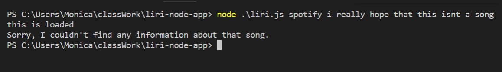

# liri-node-app

## Purpose
The purpose of this application is to utilize node.js and several npm packages to create a simple command line interface application that can return information about: 
* A band's upcoming or past concerts
* A song
* A movie

## Overview
When using this application, the user will input a command and a search term.
The command can be 'concert', 'spotify', 'movie', or 'default'.

### 'Concert' Search
If the user inputs 'concert' but *does not* input a search term, they will be prompted to run the search again with a search term.

When the user inputs the command 'concert' **and** an artist as the search term, the application will call the bandsintown API (http://www.artists.bandsintown.com/bandsintown-api/?locale=en) and return a list of that artist's shows. Each show listed will display:

1. The venue
2. The venue's location 
3. The date of the show (MM/DD/YYYY)

If no results are found with the given search term, an error message will dispay.

#### Examples
* User does not input a search term: 

* User gets a response: 

* User gets no response: 

------------------------------------------------------------------------
### 'Spotify' Search
If the user inputs 'spotify' and a search term, the application will call the spotify API, and search for the song. If the user does not input a search term, it will default to "Feel Good Inc". 

If spotify can find information about the song, information about 5 songs will be logged to the console. The information that is displayed will be:

1. Song title
2. Artist
3. Album
4. Preview URL for the song

If spotify can not find any results, an error message will be returned.

#### Examples
* User gets a response:

* User gets no response:

------------------------------------------------------------------------
### 'Movie' Search
This functions in the same way that the 'spotify' program does. Rather than use the spotify API, it calls the omdb API. If the user does not enter a movie name into the search area, the application will search "The Thing".

If omdb can find information about the movie, it will return the following information: 

1. Title
2. Plot
3. Actors
4. Year of release
5. Country
6. Language
7. IMDB rating
8. Rotten tomatoes rating

If omdb can't find information, an error message will be logged.

#### Examples
* User gets a response:

* User gets no response:

------------------------------------------------------------------------
### 'Default' search
If a user inputs 'default', the application will read the random.txt file and run the program that is listed. In this case, it will run "spotify" and search "I want to be sedated"

#### Example

